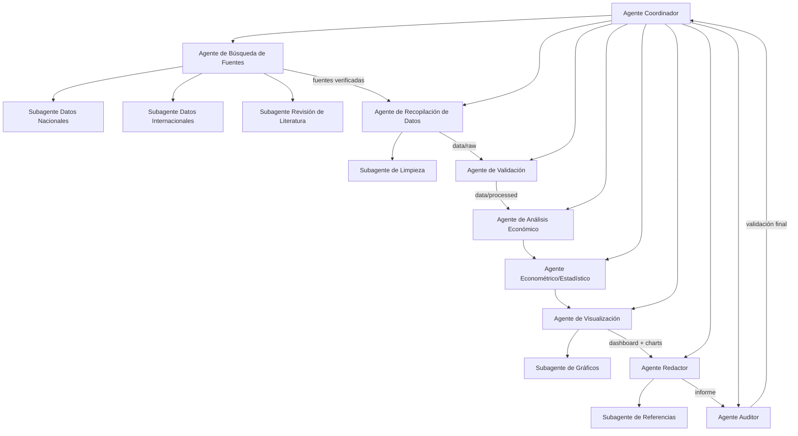

# Arquitectura Multiagéntica

## Visión general

## Flujo de trabajo

1. **Coordinador** interpreta el objetivo (analizar la inflación de Ecuador en contexto internacional) y distribuye tareas según `config/tasks.yaml`.
2. **Agente de Fuentes** localiza y verifica fuentes oficiales (Banco Mundial, BCE, INEC, FMI), delegando en sus subagentes nacional e internacional.
3. **Agente de Recopilación de Datos** descarga las series desde la API del Banco Mundial (`scripts/download_data.py`) y las guarda en `data/raw/` con metadatos.
4. **Agente de Validación** revisa faltantes, duplicados, atípicos y consistencia de unidades (`scripts/validate_data.py`), produciendo `data/processed/`.
5. **Agente de Análisis Económico** calcula indicadores comparativos y tendencias (`scripts/calculate_indicators.py`).
6. **Agente Econométrico** aplica estadística descriptiva, tasas de variación, correlación y regresión (`scripts/econometric_model.py`), con interpretación económica de cada resultado.
7. **Agente de Visualización** diseña los gráficos y tablas que alimentan el dashboard (`dashboard/`).
8. **Agente Redactor** consolida todo en el informe académico (`scripts/generate_report.py` → `docs/informe_final.pdf`).
9. **Agente Auditor** revisa trazabilidad, coherencia y estructura antes de cada entrega, registrando hallazgos en `docs/bitacora_agentes.md`.

## Por qué esto es "multiagéntico" y no "varias conversaciones sueltas"

Cada agente tiene:
- **Rol y objetivo definidos** en `agents/*.md` y `config/agents.yaml`.
- **Entradas y salidas explícitas** encadenadas mediante `config/tasks.yaml` (`depends_on` / `output`).
- **Artefactos verificables**: cada agente produce un archivo o carpeta concreta que el siguiente agente consume (no hay pasos "invisibles").
- **Prompts documentados** en `prompts/`, reutilizables y auditable.
- **Registro de ejecución** en `docs/bitacora_agentes.md`, incluyendo errores encontrados y validación humana.

## Descripción de agentes

Ver el detalle de rol, objetivo, entradas, salidas y herramientas de cada agente en su archivo individual dentro de `agents/`:

| Archivo | Agente |
|---|---|
| `agents/coordinator.md` | Coordinador |
| `agents/source_agent.md` | Búsqueda de fuentes |
| `agents/data_agent.md` | Recopilación de datos |
| `agents/validation_agent.md` | Validación |
| `agents/economic_analysis_agent.md` | Análisis económico |
| `agents/econometric_agent.md` | Econométrico/estadístico |
| `agents/visualization_agent.md` | Visualización |
| `agents/report_agent.md` | Redactor |
| `agents/audit_agent.md` | Auditor |

## Descripción de subagentes

| Archivo | Subagente | Agente padre |
|---|---|---|
| `subagents/national_data_subagent.md` | Datos nacionales (Ecuador) | Fuentes |
| `subagents/international_data_subagent.md` | Datos internacionales | Fuentes |
| `subagents/literature_subagent.md` | Revisión de literatura | Fuentes |
| `subagents/cleaning_subagent.md` | Limpieza de datos | Recopilación de datos |
| `subagents/charts_subagent.md` | Gráficos | Visualización |
| `subagents/references_subagent.md` | Referencias bibliográficas | Redactor |
